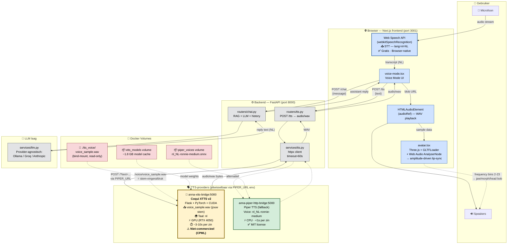

# Voice Pipeline Architectuur — Anna Remembers

Documentatie van de complete spraak-pipeline (STT + TTS + avatar) in Anna Remembers.

## Architectuur-diagram



## Componenten per laag

| Laag | Component | Licentie / Kosten | Beperking |
|---|---|---|---|
| **STT** | Web Speech API (browser) | Gratis, browser-native | Werkt alleen in Chrome/Edge; gebruikt Google's cloud-STT |
| **TTS primary** | **Coqui XTTS v2** | ⚠️ **CPML — niet-commercieel** | Alleen voor onderzoek/educatie/demo. **Niet voor productie zonder commerciële licentie.** |
| **TTS fallback** | Piper TTS | MIT (volledig vrij) | Synthetischer geluid, geen voice cloning |
| **Avatar** | Three.js + GLTFLoader | MIT | — |
| **Lip-sync** | Web Audio AnalyserNode | Browser-native | Amplitude-only, geen fonemen |

## End-to-end flow

1. **Gebruiker spreekt** → microfoon vangt audio op
2. **STT (browser)** → Web Speech API zet Nederlandse spraak om naar tekst (`lang=nl-NL`), met een silence-timer van 3s die de "klaar met praten" detecteert
3. **Chat-call** → `voice-mode.tsx` stuurt de transcript naar `POST /chat` op de backend
4. **RAG + LLM** → backend haalt context op uit ChromaDB, voegt patiëntgeschiedenis toe, en stuurt naar LLM (Ollama/Groq/Anthropic)
5. **TTS-call** → frontend stuurt het antwoord naar `POST /tts`
6. **TTS-synthese** → backend roept de bridge aan (XTTS of Piper) via `PIPER_URL`. XTTS leest `voice_sample.wav` als stem-vingerafdruk en genereert audio in jouw stem
7. **Audio playback + lip-sync** → frontend laadt WAV in `HTMLAudioElement`, koppelt aan Web Audio AnalyserNode, en de avatar beweegt mee op basis van amplitude

## Ontwerpkeuzes

### Provider-agnostisch via `PIPER_URL`
XTTS en Piper hebben dezelfde HTTP-shape (`POST /?text=...` → `audio/wav`). Switchen tussen providers = één env-var aanpassen:

```bash
# XTTS (default, voice cloning)
PIPER_URL=http://xtts-bridge:5000

# Piper (snellere fallback)
PIPER_URL=http://piper-http-bridge:5000
```

### Stem-vingerafdruk als bind-mount
`voice_sample.wav` zit als **read-only bind-mount** in de XTTS-container (`./tts_voice/` → `/voice/`). Bij elke synthese leest XTTS deze opnieuw om de speaker-embedding (~512 getallen die jouw stem beschrijven) te berekenen. Eén opname van ~15-25 sec is genoeg om elke willekeurige Nederlandse zin te genereren.

### Model cache als named volume
Het XTTS-model (~1.8 GB) wordt naar `xtts_models:/root/.local/share/tts` gecached, zodat een container-restart niet opnieuw downloadt.

### GPU passthrough
XTTS draait op de RTX 4050 via Docker's NVIDIA runtime. CPU-only zou ~30-60s per zin doen (onbruikbaar). GPU haalt dit terug naar ~3-10s.

## ⚠️ Licentie-implicatie

XTTS v2 valt onder de **[Coqui Public Model License (CPML)](https://coqui.ai/cpml)** — uitsluitend **niet-commercieel** gebruik (onderzoek, educatie, persoonlijke projecten).

Voor het Anna Remembers schoolproject is dit acceptabel (educatieve context, Fontys Semester 4). Voor een productie-deployment zou er moeten worden:
- **Teruggevallen op Piper TTS** (MIT, volledig vrij), of
- **Een commerciële XTTS-licentie** aangeschaft bij Coqui, of
- **Een alternatieve cloud-TTS** met voice cloning geïntegreerd (bv. ElevenLabs, Azure Custom Neural Voice)

## ⚠️ Bekende beperkingen — XTTS v2 voice cloning in het Nederlands

XTTS v2 is **primair getraind op Engelse data**. Andere talen (waaronder Nederlands) zijn ondersteund, maar met aanzienlijk minder trainingsmateriaal. Concreet betekent dit:

| Aspect | Engels | Nederlands |
|---|---|---|
| Natuurlijkheid synthese | Hoog | Acceptabel — soms "robot-achtig" |
| Toonhoogte-cloning | Goed | Redelijk |
| Spreekritme-cloning | Goed | Redelijk |
| Timbre-cloning | Sterk | Zwak tot middelmatig |
| Accent / uitspraak | Behoudt spreker-eigenschappen | Voelt vaak generiek aan |

**Conclusie:** XTTS v2 in NL geeft een stem die "in de buurt komt" van jouw stem qua toonhoogte en ritme, maar het timbre wordt niet 1:1 overgenomen. Dit is een fundamentele beperking van het model, niet van de configuratie.

### Mitigatie — meerdere reference clips

De bridge gebruikt **alle WAV-bestanden in `tts_voice/`** als reference clips. Meer variatie = betere speaker embedding. Aanbevolen: 2-3 opnames van elk 15-25 seconden met variatie in intonatie:

| Bestand | Inhoud-suggestie |
|---|---|
| `voice_sample.wav` | Neutrale medische tekst (statement + vraag + cijfers) |
| `sample_2.wav` | Vraag-zin met hogere intonatie. *"Hoe gaat het vandaag met u? Heeft u nog last gehad van die kortademigheid van vorige week?"* |
| `sample_3.wav` | Rustige lage zin. *"Ik begrijp dat dit moeilijk is. We nemen het rustig stap voor stap door."* |

### Productie-alternatieven voor échte NL voice cloning

Als 1:1 stem-cloning in productie nodig is:

- **ElevenLabs** — cloud, betaald, beste NL-cloning op de markt
- **Azure Custom Neural Voice** — enterprise, vereist Microsoft-goedkeuring
- **Eigen XTTS fine-tuning** — XTTS v2 zelf trainen op meer Nederlandse data (zwaar, vereist GPU-cluster)

Voor het school-project is XTTS v2 + Piper fallback een acceptabel proof-of-concept; deze beperking moet wel expliciet in de decision log staan.

---

## 📌 TODO — voice samples opnemen

Op dit moment is alleen `voice_sample.wav` aanwezig (~29 sec medische tekst). Voor betere cloning-kwaliteit zijn **2 extra opnames** nodig:

- [ ] `tts_voice/sample_2.wav` — vraag-zin met hogere intonatie (~15-25 sec)
- [ ] `tts_voice/sample_3.wav` — rustige lage zin (~15-25 sec)

Na het toevoegen van extra samples: `docker compose restart xtts-bridge`. In de logs moet komen te staan: `Using 3 reference clip(s): [...]`.

---

## Bestanden in deze pipeline

| Pad | Rol |
|---|---|
| `xtts_bridge.py` | Flask app: laadt XTTS v2 + speaker WAV, biedt `POST /` endpoint |
| `xtts_bridge.Dockerfile` | PyTorch+CUDA image met `coqui-tts` |
| `piper_http_bridge.py` | Flask app: laadt Piper voice, zelfde endpoint-shape als XTTS |
| `tts_voice/voice_sample.wav` | Jouw stem-opname (15-25s NL, mono WAV) |
| `backend/services/tts.py` | httpx client naar de bridge (timeout 60s) |
| `backend/routers/tts.py` | FastAPI endpoint `POST /tts` |
| `frontend/.../voice-mode.tsx` | Voice mode UI, koppelt STT → chat → TTS → avatar |
| `frontend/.../lib/speech.ts` | `useSpeechRecognition` hook (Web Speech API) |
| `frontend/.../components/chat/avatar.tsx` | Three.js avatar met amplitude-lip-sync |

## Setup quickstart

1. Plaats `voice_sample.wav` in `tts_voice/` (zie `tts_voice/README.md`)
2. Build & start:
   ```bash
   docker compose up -d --build xtts-bridge
   ```
3. Volg de logs tot "Model loaded.":
   ```bash
   docker compose logs -f xtts-bridge
   ```
4. Open de app op `http://localhost:3001`, ga naar een patiënt, klik voice mode.
