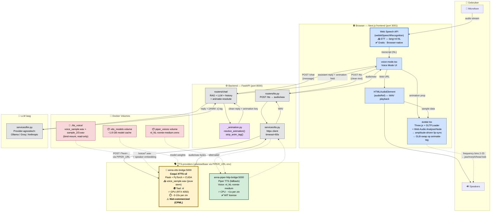

# Voice Pipeline Architectuur — Anna Remembers

Documentatie van de complete spraak-pipeline (STT + TTS + avatar + animatie) in Anna Remembers.

## Architectuur-diagram



## Componenten per laag

| Laag | Component | Licentie / Kosten | Beperking |
|---|---|---|---|
| **STT** | Web Speech API (browser) | Gratis, browser-native | Werkt alleen in Chrome/Edge; gebruikt Google's cloud-STT |
| **TTS primary** | **Coqui XTTS v2** | ⚠️ **CPML — niet-commercieel** | Alleen voor onderzoek/educatie/demo. **Niet voor productie zonder commerciële licentie.** |
| **TTS fallback** | Piper TTS | MIT (volledig vrij) | Synthetischer geluid, geen voice cloning |
| **Avatar** | Three.js + GLTFLoader | MIT | — |
| **Lip-sync** | Web Audio AnalyserNode | Browser-native | Amplitude-only, geen fonemen |
| **Animatie** | `_animation.py` + 12 GLB-bestanden | — | GLB-swap per LLM-response |

## End-to-end flow

1. **Gebruiker spreekt** → microfoon vangt audio op
2. **STT (browser)** → Web Speech API zet Nederlandse spraak om naar tekst (`lang=nl-NL`), met een silence-timer van 3s die het einde van een zin detecteert
3. **Chat-call** → `voice-mode.tsx` stuurt de transcript naar `POST /chat` op de backend
4. **RAG + LLM** → backend haalt context op uit ChromaDB, voegt patiëntgeschiedenis toe, en stuurt naar LLM (Ollama/Groq/Anthropic). De LLM plaatst een `[ANIM: x]` tag aan het begin van zijn response
5. **Animatie-resolutie** → `_animation.py` bepaalt welk 3D-model de avatar moet laden:
   - **Priority 1**: keyword-match op het gebruikersbericht (bijv. "ik ren" → `running_fast`)
   - **Priority 2**: gevalideerde `[ANIM: x]` tag uit de LLM-response (exact match tegen whitelist van 12 animaties)
   - **Priority 3**: default `standard_waiting`
   - De tag wordt altijd gestript uit de tekst — ook als hij midden in de response staat — zodat hij nooit naar de patiënt of TTS lekt
6. **TTS-call** → frontend stuurt de schone tekst (zonder animatietag) naar `POST /tts`
7. **TTS-synthese** → backend roept de bridge aan (XTTS of Piper) via `PIPER_URL`. XTTS leest alle WAV-bestanden in `tts_voice/` als speaker embedding en genereert audio in jouw stem
8. **Audio playback + lip-sync** → frontend laadt WAV in `HTMLAudioElement`, koppelt aan Web Audio AnalyserNode, en de avatar beweegt mee op basis van amplitude
9. **GLB-swap** → de `animation` field in de response bepaalt welk GLB-bestand de avatar laadt (`ANIMATION_TO_MODEL` map in `avatar.tsx`)

## Animatie-systeem

### Geldige animaties (12 GLB-bestanden in `frontend/public/`)

| Sleutel | GLB-bestand | Wanneer |
|---|---|---|
| `standard_waiting` | `standard_waiting.glb` | Default / geen match |
| `stand_look_around` | `stand_look_around.glb` | Zoekend, nadenkend |
| `running_fast` | `running_fast.glb` | Actief, bewegen |
| `standard_walk_crouching` | `standard_walk_crouching.glb` | Voorzichtig, gehurkt |
| `flexing_arm` | `flexing_arm.glb` | Kracht, positief |
| `gorilla` | `gorilla.glb` | — |
| `laying_on_floor` | `laying_on_floor.glb` | Gevallen, op de grond |
| `just_chilling` | `just_chilling.glb` | Ontspannen, rustig |
| `angry` | `angry.glb` | Bezorgd, ernstig |
| `Expressing_joy` | `Expressing_joy.glb` | Blij, positief nieuws |
| `model` | `model.glb` | — |
| `model (13)` | `model (13).glb` | — |

### Resolutie-logica (`_animation.py`)

```
resolve_animation(user_text, llm_text)
    │
    ├─ strip_anim_tag(llm_text)        ← altijd uitvoeren, ook zonder match
    │   ├─ regex op begin van tekst    ← voorkeurspositie per prompt
    │   ├─ regex anywhere in tekst     ← fallback als LLM tag midden plaatst
    │   └─ re.sub alle tags weg        ← clean_text nooit lekken naar TTS/DB
    │
    ├─ Priority 1: keyword op user_text
    ├─ Priority 2: LLM-tag (whitelist exact match)
    └─ Priority 3: "standard_waiting"
```

### LLM-prompt instructie

Anna's systeem-prompt instrueert de LLM om elke response te beginnen met:
```
[ANIM: <sleutel>]
```
Kleinere modellen (Ollama 3B) plaatsen de tag soms midden in de tekst — de strip-logica vangt dit altijd op.

## Ontwerpkeuzes

### Provider-agnostisch via `PIPER_URL`
XTTS en Piper hebben dezelfde HTTP-shape (`POST /?text=...` → `audio/wav`). Switchen = één env-var:

```bash
# XTTS (default, voice cloning)
PIPER_URL=http://xtts-bridge:5000

# Piper (snellere fallback)
PIPER_URL=http://piper-http-bridge:5000
```

ElevenLabs is een mogelijke toekomstige vervanging van `services/tts.py` — de router en frontend hoeven dan niet aan te worden geraakt.

### Stem-vingerafdruk als bind-mount
Alle WAV-bestanden in `./tts_voice/` worden als read-only bind-mount in de XTTS-container gezet (`/voice/`). XTTS middelt de speaker embeddings over alle clips — meer variatie in intonatie geeft een betere embedding. Sweet spot: 2–3 clips van elk 15–25 seconden.

### Model cache als named volume
Het XTTS-model (~1.8 GB) wordt gecached in `xtts_models:/root/.local/share/tts`, zodat een container-restart niet opnieuw downloadt.

### GPU passthrough
XTTS draait op de RTX 4050 via Docker's NVIDIA runtime. CPU-only zou ~30–60s per zin doen (onbruikbaar). GPU haalt dit terug naar ~3–10s.

### TTS via FastAPI, niet via MCP
TTS is een pure I/O-operatie (tekst → audio bytes) zonder geheugen of patiëntcontext. De MCP-server is bedoeld voor tools die data opslaan of ophalen (`store_memory`, `recall_context`, `escalate_to_human`). TTS hoort niet in die laag.

## ⚠️ Licentie-implicatie

XTTS v2 valt onder de **[Coqui Public Model License (CPML)](https://coqui.ai/cpml)** — uitsluitend **niet-commercieel** gebruik (onderzoek, educatie, persoonlijke projecten).

Voor het Anna Remembers schoolproject is dit acceptabel (educatieve context, Fontys Semester 4). Voor een productie-deployment:
- **Terugvallen op Piper TTS** (MIT, volledig vrij), of
- **ElevenLabs** integreren (cloud, betaald, beste NL-cloning) — één bestand aanpassen: `services/tts.py`, of
- **Azure Custom Neural Voice** (enterprise)

## ⚠️ Bekende beperkingen — XTTS v2 voice cloning in het Nederlands

XTTS v2 is **primair getraind op Engelse data**. Nederlands is ondersteund maar met minder trainingsmateriaal.

| Aspect | Engels | Nederlands |
|---|---|---|
| Natuurlijkheid synthese | Hoog | Acceptabel — soms "robot-achtig" |
| Toonhoogte-cloning | Goed | Redelijk |
| Spreekritme-cloning | Goed | Redelijk |
| Timbre-cloning | Sterk | Zwak tot middelmatig |

**Conclusie:** XTTS v2 in NL geeft een stem die "in de buurt komt" qua toonhoogte en ritme, maar het timbre wordt niet 1:1 overgenomen. Dit is een fundamentele beperking van het model, niet van de configuratie.

---

## 📌 TODO — voice samples

Voor optimale speaker embedding zijn 3 clips aanbevolen (variatie in intonatie):

- [ ] `tts_voice/voice_sample.wav` — neutrale medische tekst, mix stelling + vraag + cijfers (~25–40s)
- [ ] `tts_voice/sample_2.wav` — vragende intonatie, hogere toon (~25–40s)
- [ ] `tts_voice/sample_3.wav` — rustig en laag, geruststellend (~25–40s)

Na toevoegen: `docker compose restart xtts-bridge`. Logs moeten tonen: `Using 3 reference clip(s): [...]`.

---

## Bestanden in deze pipeline

| Pad | Rol |
|---|---|
| `xtts_bridge.py` | Flask app: laadt XTTS v2 + speaker WAVs, biedt `POST /` endpoint |
| `xtts_bridge.Dockerfile` | PyTorch+CUDA image met `coqui-tts` |
| `piper_http_bridge.py` | Flask app: laadt Piper voice, zelfde endpoint-shape als XTTS |
| `tts_voice/*.wav` | Stem-opnames (15–40s NL, mono WAV, 22050 Hz) |
| `backend/services/tts.py` | httpx client naar de bridge (timeout 60s) |
| `backend/routers/tts.py` | FastAPI endpoint `POST /tts` |
| `backend/routers/chat/_animation.py` | Animatie-resolutie util: `resolve_animation()`, `strip_anim_tag()` |
| `frontend/.../voice-mode.tsx` | Voice mode UI: STT → chat → TTS → avatar |
| `frontend/.../lib/speech.ts` | `useSpeechRecognition` hook (Web Speech API) |
| `frontend/.../components/chat/avatar.tsx` | Three.js avatar: amplitude-lip-sync + GLB-swap op `animation` prop |
| `frontend/.../public/*.glb` | 12 animatie-bestanden |

## Setup quickstart

1. Neem 1–3 voice samples op (NL, mono WAV, 22050 Hz) en plaats ze in `tts_voice/`
2. Build & start:
   ```bash
   docker compose up -d --build xtts-bridge
   ```
3. Volg de logs tot "Model loaded.":
   ```bash
   docker compose logs -f xtts-bridge
   ```
4. Open de app op `http://localhost:3001`, ga naar een patiënt, klik voice mode.
