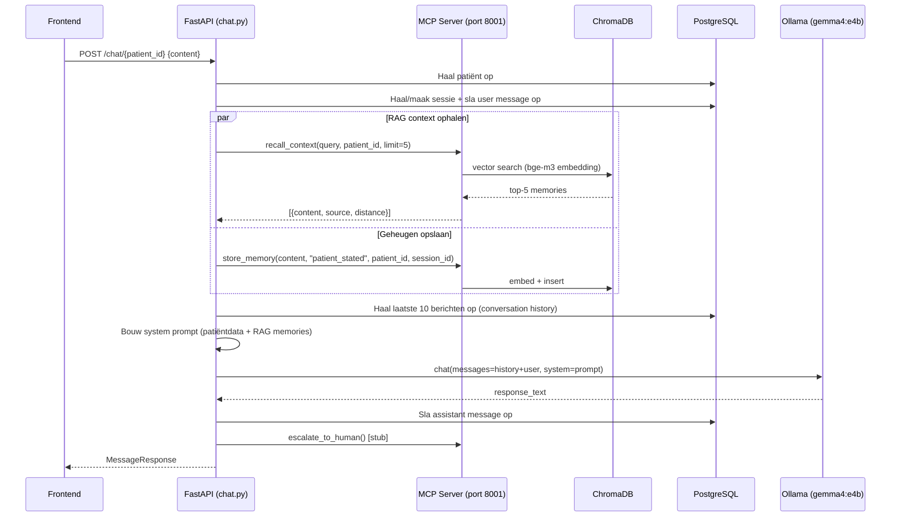
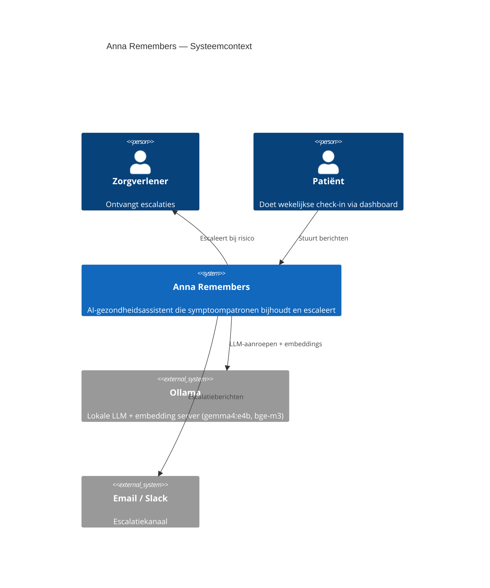
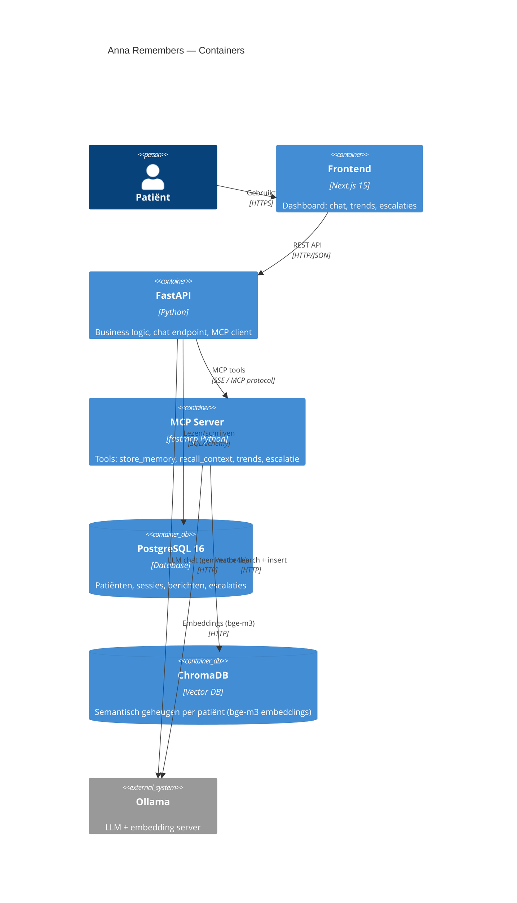
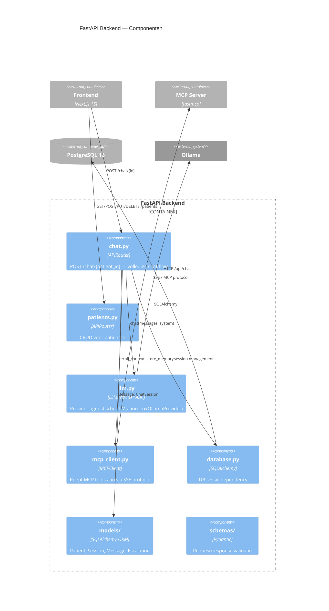
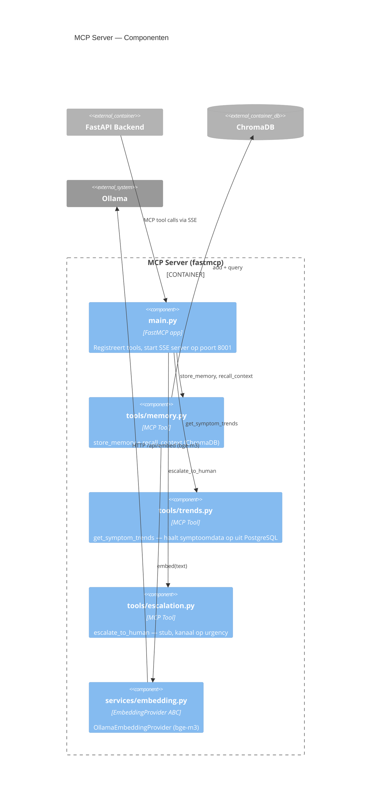

# Design: Chat Endpoint — FastAPI ↔ MCP ↔ LLM

**Datum:** 2026-05-11  
**Issue:** Backend: Chat endpoint wiren (FastAPI ↔ MCP ↔ LLM)  
**Status:** Goedgekeurd, klaar voor implementatie

---

## Doelstelling

`POST /chat/{patient_id}` volledig werkend maken:  
bericht ontvangen → RAG-context ophalen → LLM aanroepen → antwoord opslaan.

**Acceptatiecriteria:**
- `recall_context` aangeroepen vóór LLM-call
- `store_memory` na elk patiëntbericht (`source=patient_stated`)
- LLM-aanroep via `services/llm.py` (provider-agnostisch)
- Ollama + gemma4:e4b geeft antwoord terug
- Sessie + berichten opgeslagen in PostgreSQL

---

## Architectuurkeuze: MCP communicatie via SSE

De MCP server draait als apart proces op poort 8001 (SSE transport, via `fastmcp`).  
FastAPI praat via `fastmcp.Client` over het echte MCP-protocol — exact zoals de architectuurregels in CLAUDE.md voorschrijven.

**Verworpen alternatieven:**
- HTTP REST wrapper op MCP server — dupliceert de interface, breekt architectuurregel
- Directe import van MCP functies in FastAPI — verboden per CLAUDE.md ("apart proces")

---

## Volledige chat-flow



### Latency breakdown

| Stap | Tijd |
|---|---|
| PostgreSQL queries | ~5ms |
| `recall_context` + `store_memory` (parallel) | ~100–150ms |
| LLM aanroep (gemma4:e4b) | 1.000–5.000ms |
| **Totaal** | **~1.1–5.2s** |

`recall_context` en `store_memory` draaien parallel via `asyncio.gather()` per CLAUDE.md architectuurregel.

---

## System prompt constructie

De system prompt bestaat uit drie lagen:

```
┌─────────────────────────────────────────────────────┐
│ LAAG 1 — Persona (statisch)                         │
│ "Je bent Anna, empathische AI-assistent voor        │
│  hartfalenpatiënten..."                             │
├─────────────────────────────────────────────────────┤
│ LAAG 2 — Patiëntcontext (uit PostgreSQL)            │
│ Naam, medicatieschema, notities                     │
├─────────────────────────────────────────────────────┤
│ LAAG 3 — RAG memories (uit ChromaDB, max 5)         │
│ "Relevante eerdere uitspraken van deze patiënt:"    │
│ - [patient_stated] "Afgelopen week meer kortademig" │
│ - [ai_inferred] "Loopt elke dag 20 minuten"         │
└─────────────────────────────────────────────────────┘
```

**Regels in de prompt:**
- Verzin nooit symptomen of medicatie die de patiënt niet heeft gemeld
- Refereer aan eerdere uitspraken als die relevant zijn
- Stel één gerichte vervolgvraag per response

De `source`-tag (`patient_stated` vs `ai_inferred`) staat expliciet in de prompt zodat het model weet welke herinneringen feiten zijn vs inferenties.

### Conversation history

Laatste **10 berichten** uit PostgreSQL (huidige sessie) worden als `messages`-lijst meegegeven aan de LLM. RAG-context zit in de system prompt, niet in de history.

---

## `mcp_client.py` — technisch ontwerp

```python
class MCPClient:
    def __init__(self, base_url: str): ...
    async def recall_context(self, query, patient_id, limit) -> list[dict]: ...
    async def store_memory(self, content, source, patient_id, session_id) -> str: ...
    async def get_symptom_trends(self, patient_id, weeks) -> dict: ...  # stub
    async def escalate_to_human(self, patient_id, reason, urgency) -> None: ...  # stub

def get_mcp_client() -> MCPClient:
    """FastAPI dependency — leest MCP_URL uit env."""
```

- Elke methode opent een korte SSE-verbinding via `fastmcp.Client`
- `get_mcp_client()` is een FastAPI `Depends()` dependency zodat de URL uit env komt
- Stubs (`get_symptom_trends`, `escalate_to_human`) zijn aanwezig voor latere implementatie

---

## C4 Diagrammen

### Level 1 — Systeemcontext



### Level 2 — Containers



### Level 3 — Componenten: FastAPI Backend



### Level 3 — Componenten: MCP Server



---

## Escalatie — stub voor latere uitbreiding

`escalate_to_human` staat in de chat flow maar doet momenteel niets. De interface is:

```python
async def escalate_to_human(patient_id, reason, urgency) -> None:
    # urgency: "low" | "medium" | "high"
    # kanaal: email (low/medium) | Slack (high)
    pass  # stub — implementatie volgt
```

De methode staat in `MCPClient` zodat de chat router er al naar kan verwijzen zonder aanpassingen later.

---

## Bestanden die wijzigen

| Bestand | Wijziging |
|---|---|
| `backend/services/mcp_client.py` | Volledige implementatie van `MCPClient` klasse |
| `backend/routers/chat.py` | MCP-calls indraden, system prompt uitbreiden, history ophalen |
| `mcp-server/tools/escalation.py` | Nieuw bestand — stub implementatie |
| `mcp-server/main.py` | `escalate_to_human` tool registreren |

**Buiten scope van dit issue:**
- `mcp-server/tools/trends.py` — wordt aangemaakt in een volgend issue (get_symptom_trends). De C4 L3 diagram toont dit component al omdat het deel is van de uiteindelijke architectuur, maar de implementatie volgt later.
- `MCPClient.get_symptom_trends()` is een stub (pass) — de MCP server hoeft `trends.py` nog niet te hebben.
