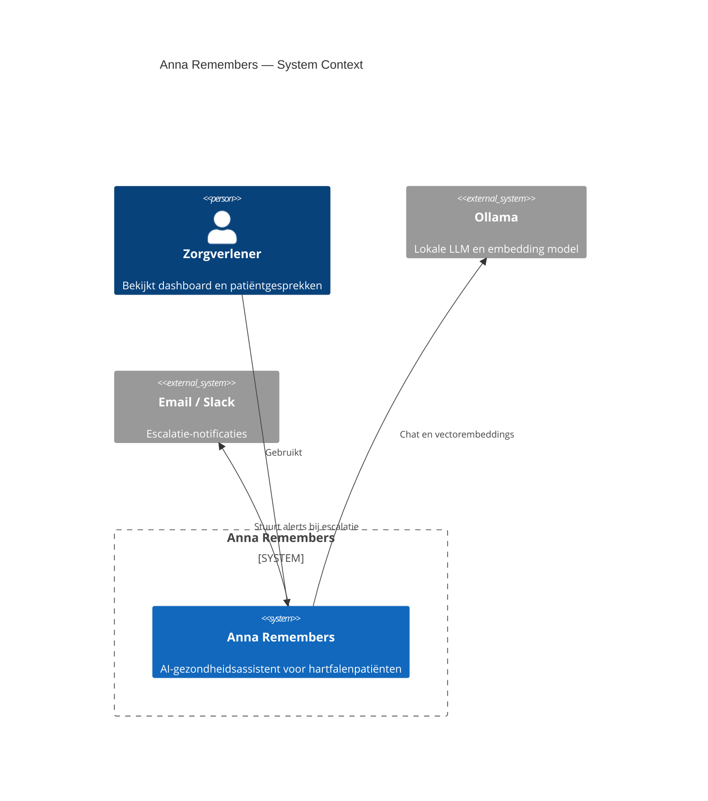
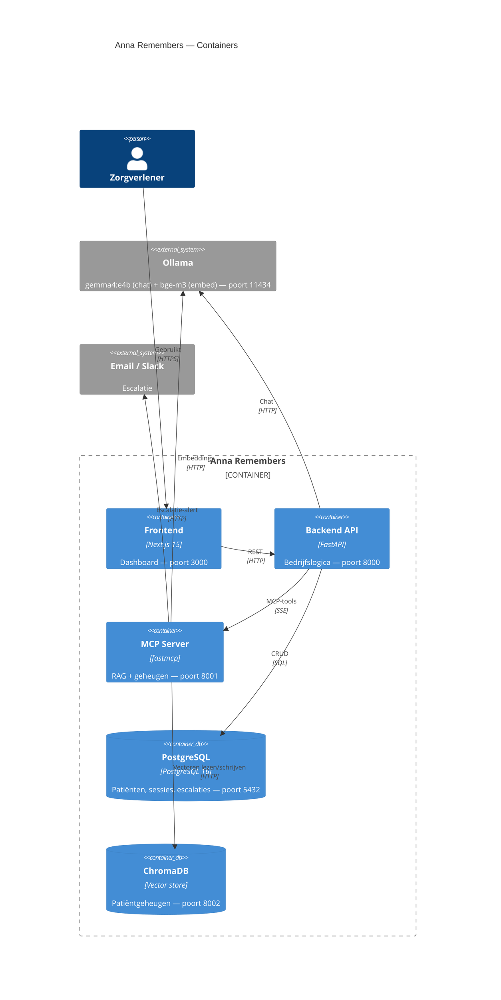
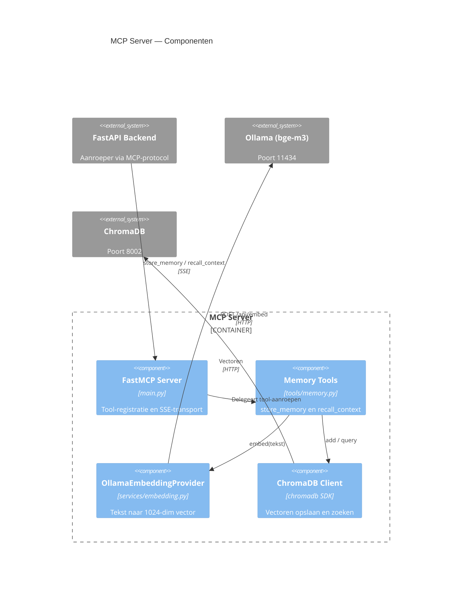

# Evidence 01 — C4 Architectuurdiagrammen

**Type:** architectuurdiagram
**Datum:** 2026-05-08
**Hoort bij:** Stap 10, DL2 (embedding model keuze)
**Commit:** ea89e9a

---

## Level 1 — System Context

---

## Level 2 — Container

---

## Level 3 — Component (MCP Server)

---

## Bronnen

1. Brown, S. (2018). *The C4 model for visualising software architecture*. c4model.com
