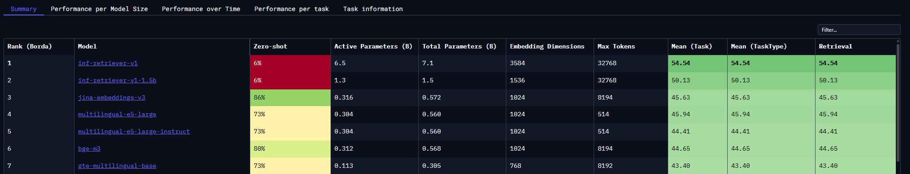

# Evidence 02 — Embedding model vergelijking

**Type:** Vergelijkingstabel + DOT-onderzoeksverantwoording  
**Datum:** 2026-05-08  
**Hoort bij:** Decision log DL2 — Embedding model keuze, Stap 10 in STAPPEN.md  
**Commit:** `b30feef` (design spec), `a33ca43` (implementatie)

---

## DOT-methode verantwoording

### Wat ik onderzocht heb

Ik moest een embedding model kiezen voor de RAG-pipeline in de MCP-server. Het model bepaalt hoe goed Anna semantisch vergelijkbare herinneringen terugvindt bij een patiëntvraag — en daarmee of ze correcte context teruggeeft of hallucinaties produceert.

De twee bronnen die ik heb geraadpleegd:

**1. MTEB BEIR-NL Leaderboard (Hugging Face) [1]**  
MTEB (Massive Text Embedding Benchmark) is de gestandaardiseerde benchmark voor het vergelijken van embedding modellen. Het test modellen op een reeks taken, waarvan retrieval de meest relevante is voor RAG-toepassingen: geeft het model bij een zoekvraag de daadwerkelijk relevante documenten terug? BEIR-NL is de Nederlandstalige variant van die retrievalbenchmark — dezelfde methodiek, maar toegepast op Nederlandstalige datasets. Elk model krijgt een Retrieval-score, zodat je gericht kunt vergelijken op de taal die je project nodig heeft.

bge-m3 staat op **positie 6** op de BEIR-NL ranking. De vijf modellen erboven zijn om verschillende redenen geen optie:

| Positie | Model | Reden niet gekozen |
|---|---|---|
| #1 | inf-retriever-v1 | Niet in Ollama; 3584 dims (ChromaDB al ingericht op 1024) |
| #2 | inf-retriever-v1-1.5b | Niet in Ollama; 1536 dims |
| #3 | jina-embeddings-v3 | Vereist Jina API-sleutel voor productiegebruik — niet puur lokaal |
| #4 | multilingual-e5-large | 514 max tokens — te kort voor sessiesamenvattingen |
| #5 | multilingual-e5-large-instruct | 514 max tokens — zelfde probleem |

bge-m3 is daarmee het hoogst gerankte model dat volledig lokaal draait via Ollama én voldoende context heeft.

---

**2. Ollama Model Library [2]**  
Per model: modelgrootte (VRAM-gebruik), contextlengte, beschikbaarheid via `ollama pull`.

**3. bge-m3 paper (arXiv:2402.03216) [3]**  
Technisch document van de BAAI-onderzoekers over het trainingsproces van bge-m3. Bevestigt: getraind op 100+ talen, inclusief Dutch Common Crawl en Wikipedia. Verklaart waarom de meertalige scores hoger zijn dan bij nomic-embed-text.

---

## Vergelijkingstabel

| Criterium | bge-m3 | mxbai-embed-large | nomic-embed-text |
|---|---|---|---|
| **BEIR-NL positie** | #6 | Niet in top-10 | Niet in top-10 |
| **VRAM geladen** | ~1.5 GB | ~670 MB | ~270 MB |
| **Contextlengte** | 8192 tokens | 512 tokens | 2048 tokens |
| **Vectordimensies** | 1024 | 1024 | 768 |
| **Beschikbaar via Ollama** | ✅ | ✅ | ✅ |
| **Voldoet aan alle criteria** | ✅ | ❌ (context te kort) | ❌ (niet meertalig) |

---

## Redenering per afgevallen kandidaat

**nomic-embed-text:**  
Staat niet in de top-10 van BEIR-NL [1]. Het is primair op Engels getraind — voor zorgdomein-specifieke Nederlandse termen als "kortademig" of "enkelvoetoedeem" geeft dat minder relevante semantische matches. Dat verhoogt het risico dat Anna relevante herinneringen mist.

**mxbai-embed-large:**  
512-token contextlimiet [2]. Een sessiesamenvatting van ~250 woorden is ~350 tokens. Dat haalt de grens, maar een samenvatting plus een symptoomnotitie in één geheugenblok gaat al over de limiet. Tekst die de limiet overschrijdt wordt stilletjes afgeknipt — dan embedden twee vergelijkbare herinneringen met verschillende vectoren omdat de ene afgeknipt is en de andere niet. Dat ondermijnt de retrieval-kwaliteit juist bij langere, informatierijke geheugens.

---

## VRAM-berekening

| Component | VRAM bij gebruik |
|---|---|
| gemma4:e4b (chat) | ~4.0 GB |
| bge-m3 (embed) | ~1.5 GB |
| Tegelijk geladen | ~5.5 GB — past niet in RTX 4050 (6 GB) |
| Via model-swapping | Ollama wisselt op aanvraag, nooit tegelijk |

**Model-swapping** [2]: Ollama houdt nooit meer dan één model tegelijk in VRAM geladen. Als een aanroep binnenkomt voor een model dat niet geladen is, wordt het huidige model uit VRAM verwijderd en het gevraagde model ingeladen. Dat wisselen duurt doorgaans 1-3 seconden. Op projectschaal (geen simultane chat- en embed-aanroepen) is dit geen merkbaar probleem — de LLM-aanroep zelf duurt ook al 1-3 seconden.

---

## Bronnen

**(1)** MTEB Leaderboard — Massive Text Embedding Benchmark. Hugging Face.  
[https://huggingface.co/spaces/mteb/leaderboard](https://huggingface.co/spaces/mteb/leaderboard)

**(2)** Ollama Model Library.  
[https://ollama.com/library](https://ollama.com/library)

**(3)** Xiao, S. et al. (2024). *M3-Embedding: Multi-Linguality, Multi-Functionality, Multi-Granularity Text Embeddings Through Self-Knowledge Distillation.* arXiv:2402.03216.  
[https://arxiv.org/abs/2402.03216](https://arxiv.org/abs/2402.03216)
