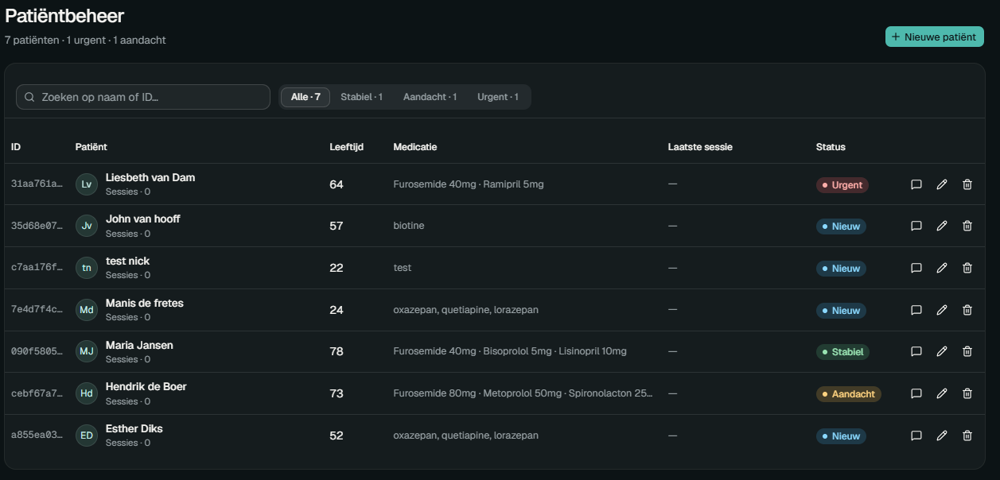
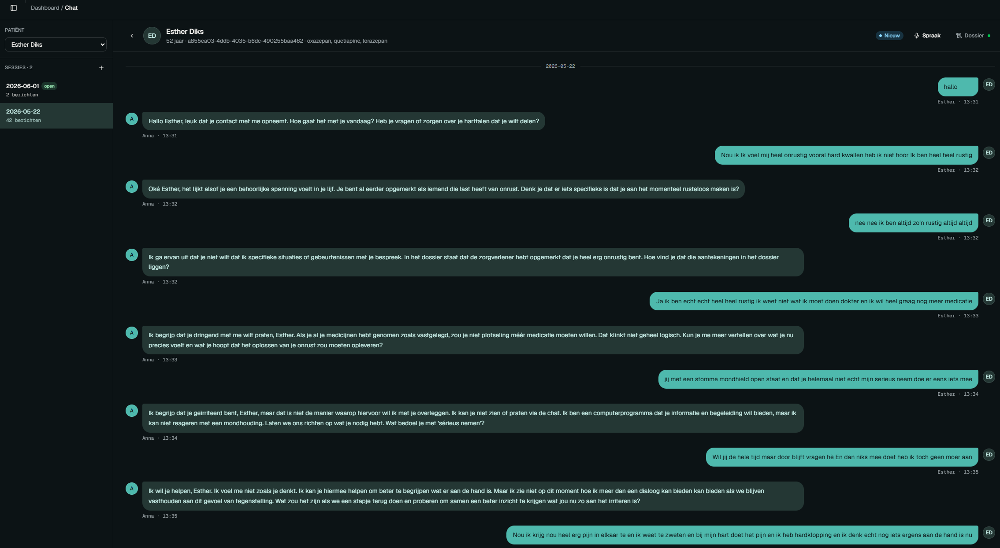
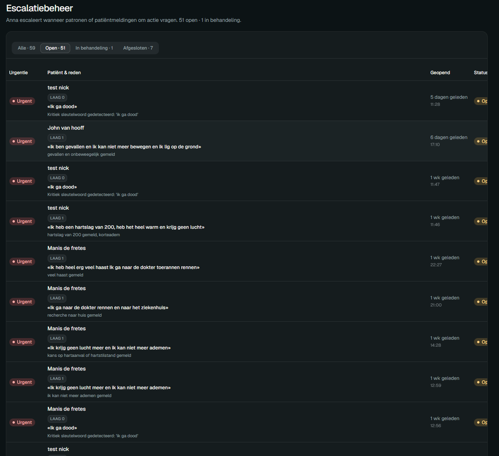

# Evidence 03 — Frontend framework vergelijking

**Type:** Vergelijkingstabel  
**Datum:** 2026-05-09  
**Hoort bij:** DL3 — Frontend architectuur, Stap 13 in STAPPEN.md  
**Commit:** `e8123a4`

---

## Onderzoeksvraag

Welk frontend framework gebruik ik voor het Anna Remembers dashboard?

## DOT-methode: Beschikbaar product analyseren (Library)

Drie opties vergeleken op criteria die relevant zijn voor dit project.

| Criterium | Next.js 15 (App Router) | Vite + React SPA | Create React App |
|---|---|---|---|
| **Routing** | File-based, ingebouwd | Handmatig via React Router | Handmatig via React Router |
| **shadcn/ui compatibel** | Ja — officiële Next.js template beschikbaar | Ja, handmatige configuratie | Ja, handmatige configuratie |
| **SSR / SSG** | Ingebouwd (optioneel) | Niet ingebouwd | Niet ingebouwd |
| **Actief onderhouden** | Ja | Ja | Nee — deprecated [1] |
| **Setup via CLI** | `create-next-app` — volledig geconfigureerd | `npm create vite` — basis setup | `npx create-react-app` — deprecated |
| **Gangbaar in werkveld** | Ja — meest gebruikte React meta-framework [2] | Ja — populair voor SPAs | Nee |

## Overwegingen

SSR is voor dit project buiten scope — het dashboard is een intern tool voor zorgverleners, geen publieke website. Dat is ook expliciet vastgelegd in CLAUDE.md.

Toch heb ik Next.js boven Vite gekozen:
- File-based routing werkt direct via mappen. Bij Vite had ik React Router moeten installeren en configureren.
- `npx shadcn@latest init` detecteert Next.js automatisch en configureert Tailwind, paths en `components.json` correct. Bij Vite zijn handmatige aanpassingen nodig.

CRA is direct afgevallen omdat het niet meer actief wordt onderhouden [1].

De App Router brengt `"use client"` verplichtingen mee voor componenten met `useState`, `useEffect` of event handlers. Dat kostte even gewenning, maar is de richting die Next.js aanbeveelt voor nieuwe projecten [2].

## Resultaat

Next.js 15 met App Router gekozen. Skelet opgezet met `create-next-app`, route group `(dashboard)` aangemaakt voor de gedeelde sidebar layout. Prototype met vier navigeerbare schermen was binnen 30 minuten werkend.

### Vier werkende schermen

**Patiëntbeheer** — CRUD voor patiënten, live gekoppeld aan FastAPI

**Chat met Anna** — gesprek starten per patiënt, volledige gesprekshistorie

**Symptoomtrends** — grafieken per patiënt (hardcoded data, klaar voor live koppeling met issue #13)

.png)

**Escalatiebeheer** — overzicht van alle escalaties met urgentie en reden

---

## Bronnen

**(1)** Facebook/Meta. (2023). *Create React App — unmaintained.*  
[https://github.com/facebook/create-react-app](https://github.com/facebook/create-react-app)

**(2)** Next.js Documentation. (2024). *App Router.*  
[https://nextjs.org/docs/app](https://nextjs.org/docs/app)
