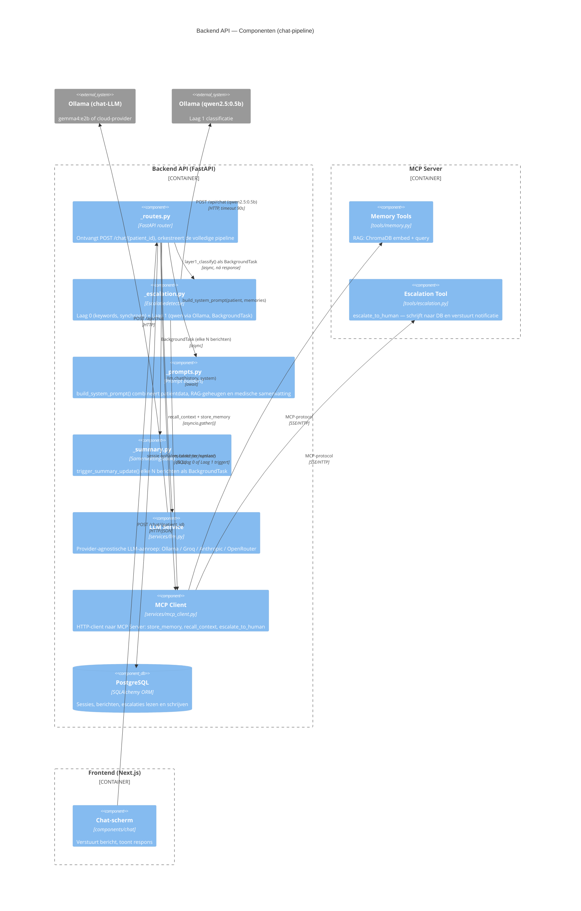
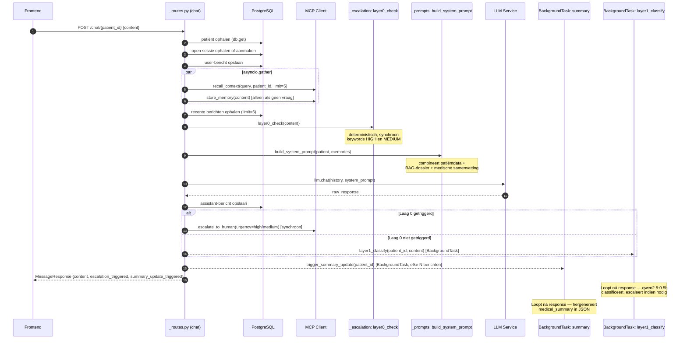

# Evidence 07 — C3 & C4: Chat-pipeline van gebruikersinvoer tot respons

**Type:** architectuurdiagram
**Datum:** 2026-05-17
**Hoort bij:** Stap 42, DL4 (escalatiedetectie — gelaagde architectuur)
**Commit:** (nog niet gecommit)

---

## Level 3 — Component (Backend API, chat-package)

Toont de componenten binnen de FastAPI backend die bij elke chat-aanvraag betrokken zijn.
De chat-router is na stap 42 opgesplitst in vier interne modules.

---

## Level 4 — Code (volgorde van aanroepen binnen één chat-request)

Toont de exacte aanroepvolgorde binnen `_routes.py → chat()` voor één POST-aanvraag.
Grijs = loopt parallel via `asyncio.gather()`. Stippellijn = BackgroundTask (loopt ná de HTTP-response).

---

## Toelichting

| Stap | Wat | Waarom zo |
|---|---|---|
| 1–3 | Sessie + bericht opslaan vóór LLM | Altijd persisteren, ook bij LLM-fout |
| 4 | `asyncio.gather` voor RAG + store | Beide MCP-aanroepen zijn onafhankelijk; parallel bespaart ~200–400 ms |
| 5 | `layer0_check` vóór LLM | Kritieke keywords hoeven niet door LLM bevestigd te worden; sneller en deterministisch |
| 6 | `build_system_prompt` combineert drie blokken | Patiëntdata (statisch) + RAG-dossier (semantisch) + samenvatting (longitudinaal) |
| 7 | LLM-aanroep | Domineert latency (~500–3000 ms); rest is ruis |
| 8 | Laag 0 → synchroon escaleren | Hoge urgentie mag response niet blokkeren, maar wel vóór teruggeven |
| 9 | Laag 1 als BackgroundTask | Qwen-aanroep kan 1–90 s duren; mag response niet vertragen |
| 10 | Samenvatting als BackgroundTask | LLM-aanroep voor samenvatting hoort niet in de gebruikerslatency |

---

## Bronnen

1. Brown, S. (2018). *The C4 model for visualising software architecture*. c4model.com
2. FastAPI. (2024). *Background Tasks*. fastapi.tiangolo.com/tutorial/background-tasks
