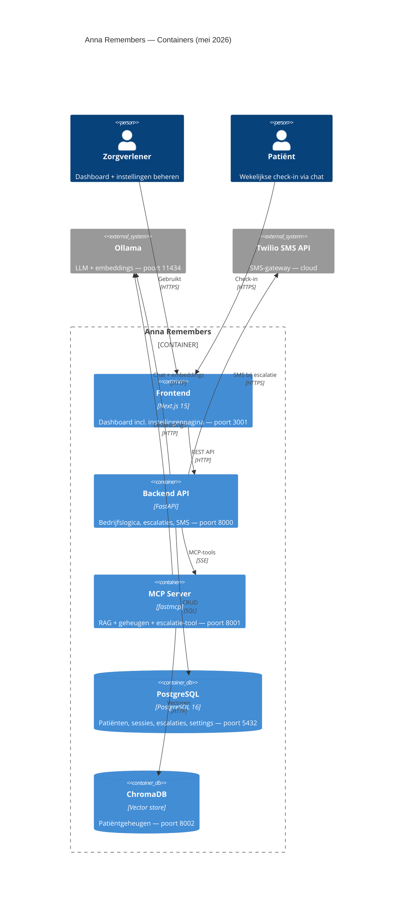
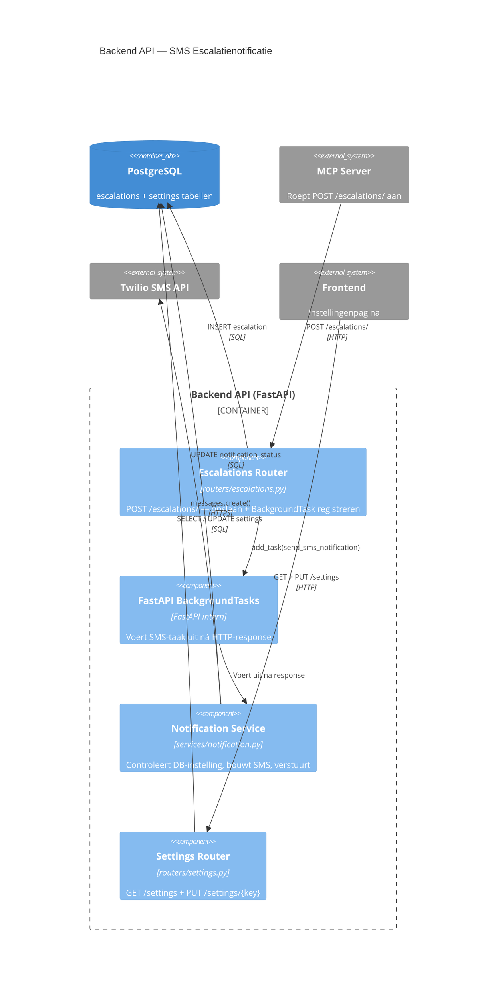

# Evidence 10 — SMS-escalatienotificaties en instellingenpagina

**Type:** Architectuurdiagrammen (C2 + C3) + implementatiebewijs
**Datum:** 2026-05-23
**Hoort bij:** Stappen 64–71 in STAPPEN.md
**Commits:** `f8f6278` · `6e88280` · `331a7a5` · `74fec3e` · `c59f622` · `eed16ef` · `6c9cce7`

---

## C2 — Container (bijgewerkt: Twilio vervangt Email/Slack)

---

## C3 — Component (Backend: SMS-notificatieflow)

---

## Ontwerpbeslissingen

| Beslissing | Keuze | Reden |
|---|---|---|
| Notificatiekanaal | Twilio SMS | Gratis trial, realistisch voor zorgdomein |
| Timing SMS-aanroep | FastAPI BackgroundTask | API blokkeert niet op Twilio-latency |
| Instelling opslaan | Key-value `settings` tabel | Live aan/uit zonder herstart; uitbreidbaar |
| Frontend toggle | Optimistic update | Directe feedback, rollback bij fout |

---

## Testbewijs

| Test | Resultaat |
|---|---|
| SMS-tekst URGENT bij `high` | ✅ |
| SMS-tekst Aandacht bij `low/medium` | ✅ |
| Overgeslagen zonder Twilio-config | ✅ |
| `notification_status = "sent"` na succesvolle SMS | ✅ |
| `notification_status = "failed"` bij Twilio-fout | ✅ |
| Overgeslagen als `twilio_sms_enabled = false` | ✅ |
| GET /settings geeft key-value dict | ✅ |
| PUT /settings/{key} wijzigt waarde | ✅ |
| PUT met onbekende key → 404 | ✅ |

**Totaal: 9/9 notification tests + 3/3 settings tests geslaagd**

---

## Bronnen

1. Twilio. (z.d.). *Python helper library quickstart*. https://www.twilio.com/docs/libraries/python
2. Tiangolo, S. (z.d.). *Background tasks*. FastAPI Documentation. https://fastapi.tiangolo.com/tutorial/background-tasks/
3. Brown, S. (2018). *The C4 model for visualising software architecture*. c4model.com
