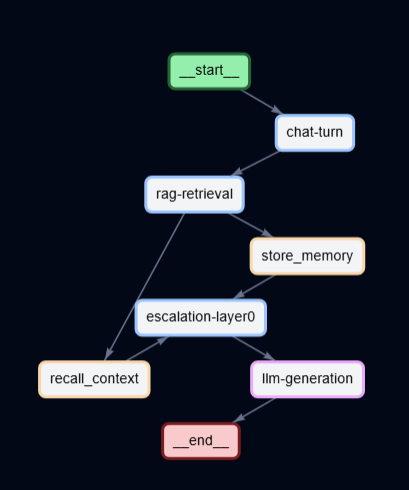
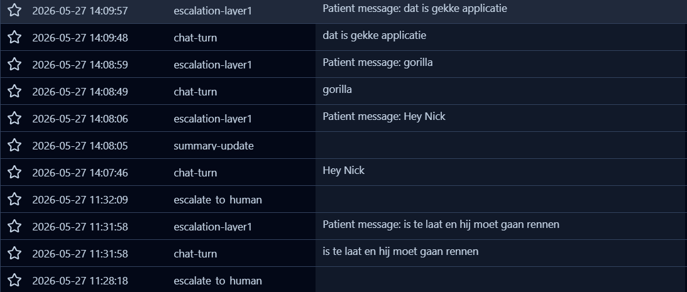
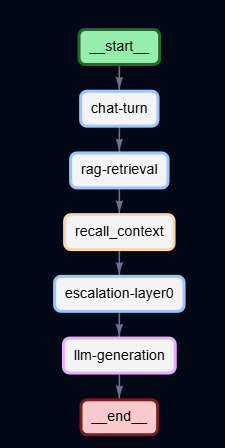
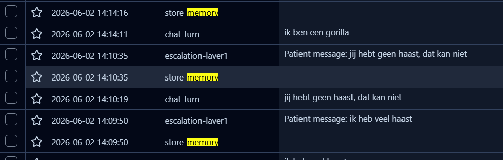

# Evidence 13 — Latency optimalisatie: voor/na via Langfuse traces

**Type:** benchmark
**Datum:** 2026-06-02
**Hoort bij:** STAPPEN.md stap 79
**Bestanden gewijzigd:** `mcp-server/services/embedding.py`, `mcp-server/main.py`, `backend/routers/chat/_routes.py`

---

## Probleem

Via Langfuse tracing bleek dat `store_memory` en `recall_context` (MCP-aanroepen naar Ollama/ChromaDB) de bottleneck waren — niet de LLM.

| Component | p50 vóór | p50 ná |
|---|---|---|
| store_memory | 6.68s | **0.28s** |
| recall_context | 5.28s | 4.38s |
| llm-generation | 0.43s | 3.70s |
| chat-turn (totaal) | ~8s (p95: **1m+**) | ~8.5s (p95: **8.6s**) |

---

## Wijzigingen

1. **`store_memory` → BackgroundTask** — hoeft niet te blokkeren vóór de LLM, alleen `recall_context` is nodig voor de system prompt
2. **`keep_alive: -1`** in Ollama embed-aanroepen — bge-m3 blijft in VRAM, geen herlaad na inactiviteit
3. **Persistent `httpx.AsyncClient`** op de embedding provider — geen nieuwe TCP-verbinding per aanroep
4. **Warmup bij opstarten** (`mcp-server/main.py`) — bge-m3 direct in VRAM bij start

---

## Vóór — trace structuur (26 mei)

`store_memory` zit als child-span genest binnen de `chat-turn`, blokkerend vóór de LLM-aanroep:

Trace-lijst van 27 mei — geen losse `store_memory` entries:

---

## Ná — trace structuur (2 juni)

`store_memory` is verdwenen uit de `chat-turn` span:

`store_memory` staat nu als losse root-trace naast de `chat-turn`, na het versturen van de response:

