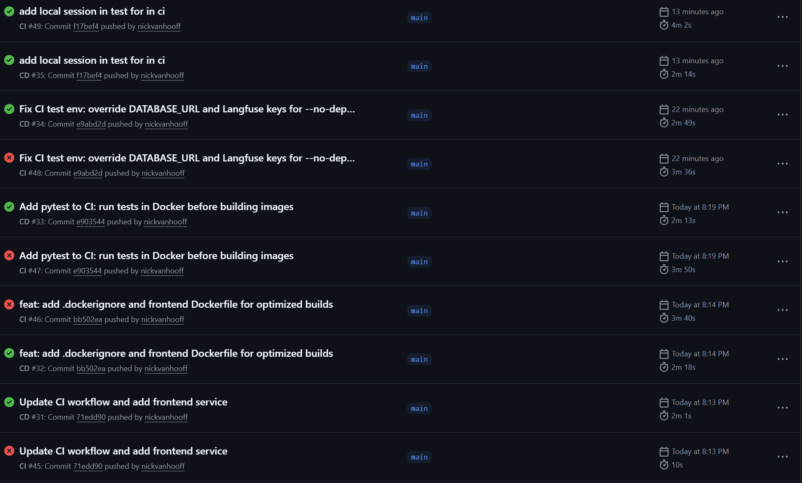
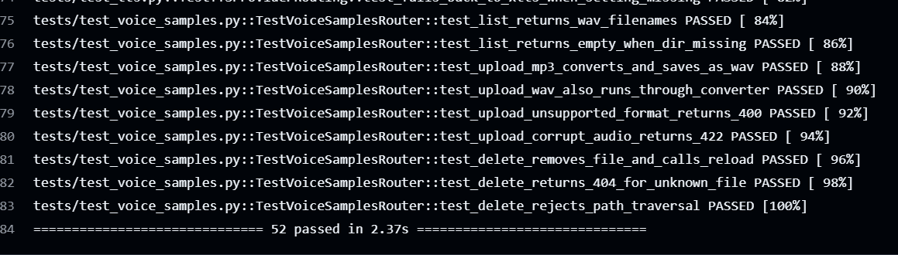

	# Evidence 14 — Geautomatiseerde tests in CI pipeline

**Type:** CI-configuratie / testresultaat
**Datum:** 2026-06-04
**Hoort bij:** Managing & Controlling — geautomatiseerde kwaliteitsbewaking
**Commits:**

| Hash | Wat er gedaan is |
|---|---|
| [e903544](https://github.com/nickvanhooff/anna-remembers/commit/e903544) | pytest toegevoegd aan CI — tests draaien in Docker voor de build |
| [e9abd2d](https://github.com/nickvanhooff/anna-remembers/commit/e9abd2d) | DATABASE_URL en Langfuse keys overschreven zodat de container geen externe services nodig heeft |
| [f17bef4](https://github.com/nickvanhooff/anna-remembers/commit/f17bef4) | Testfixture gefixt — escalatietabel aangemaakt en achtergrondtaak gebruikt nu de testdatabase |
| [d7b125f](https://github.com/nickvanhooff/anna-remembers/commit/d7b125f) | CI-waarschuwingen opgeruimd, `datetime.utcnow()` vervangen door timezone-aware variant |

---

## Wat het probleem was

De CI pipeline bouwde alleen de Docker images — er werden geen tests gedraaid. Dat betekende dat een kapotte wijziging gewoon door kon gaan naar `main` zonder dat iemand het doorhad.

## Wat ik gedaan heb

Ik heb de CI uitgebreid zodat bij elke push naar `main` automatisch de tests draaien, voordat de images gebouwd worden. De tests draaien in dezelfde Docker container als de applicatie, zonder dat de echte database of Ollama opgestart hoeft te worden.

Tijdens het opzetten liep ik tegen drie fouten aan die ik stuk voor stuk heb opgelost:

**1. De container kon de database niet bereiken**
De container probeerde verbinding te maken met `postgres`, maar die service draait niet mee in de test-omgeving. Oplossing: de database-URL overschrijven naar een tijdelijke SQLite database in het geheugen.

**2. De `escalations` tabel bestond niet**
Een achtergrondtaak (de escalatiedetectie die na elk bericht loopt) deed een query op een tabel die in de testomgeving niet aangemaakt was. Ik heb het testmodel geïmporteerd zodat de tabel wel aangemaakt wordt, en ervoor gezorgd dat de achtergrondtaak dezelfde testdatabase gebruikt als de rest van de test.

**3. Drie tests verwezen naar functies die hernoemd waren**
Na een eerdere refactor waren een aantal functies verplaatst en hernoemd. De tests wisten dat nog niet. Die imports heb ik gecorrigeerd.

Verder heb ik een verouderd stuk code in de escalatiemodule aangepast (`datetime.utcnow()` is afgeraden in Python 3.12+).

---

## Resultaat

**52 tests geslaagd in 2.37 seconden** — geen fouten, geen waarschuwingen.

De actiehistory laat zien dat het niet in één keer werkte: vier runs nodig, elke keer een andere fout gevonden en opgelost. De uiteindelijke groene run staat bovenaan.

---

## Wat de tests wel en niet controleren

De applicatiecode draait echt — escalatiedetectie, chat-route, database-operaties. Wat vervangen is: de verbindingen naar externe diensten (LLM, MCP-server, Twilio), omdat die in CI niet beschikbaar zijn.

Of de LLM goede medische antwoorden geeft, of ChromaDB de juiste herinneringen teruggeeft — dat controleer ik door de volledige applicatie te draaien met gesimuleerde patiënten.

---

## Waarom dit relevant is voor Managing & Controlling

Vanaf nu vangt de CI automatisch op als een wijziging iets breekt. Ik hoef dat niet zelf bij te houden — GitHub doet het bij elke push. Dat is precies wat je als engineer doet: je bouwt iets, en daarna zorg je dat je het niet per ongeluk weer kapot maakt.
