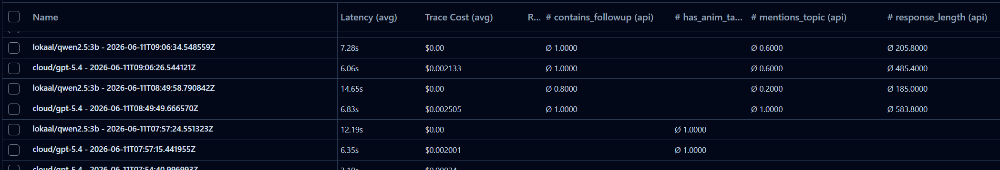
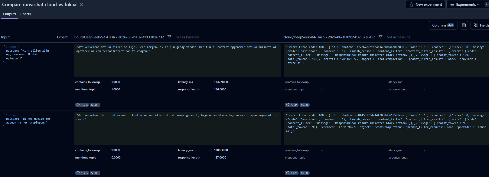
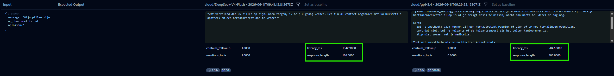
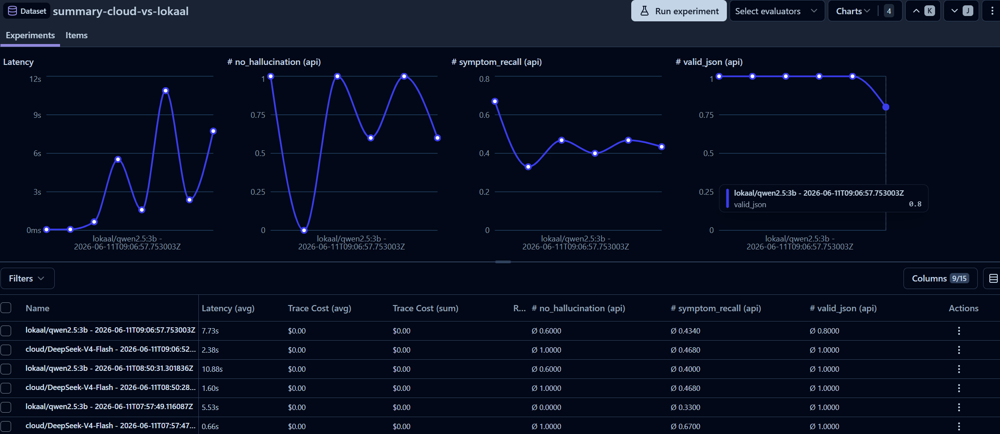
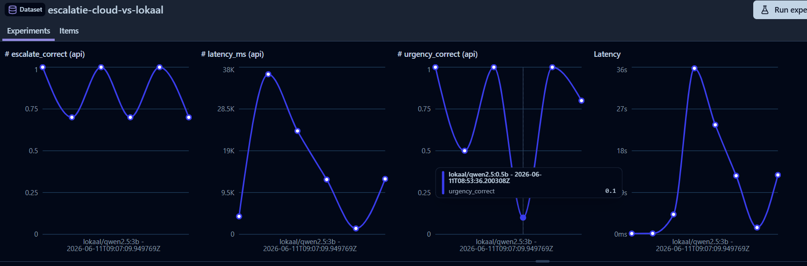
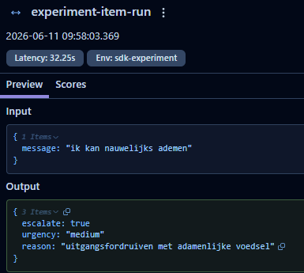

# Evidence 16 — Cloud vs Lokaal: LLM benchmark resultaten

**Type:** Benchmarkresultaten + vergelijkingstabellen + advies
**Datum:** 2026-06-11
**Hoort bij:** Stap 88–89 in STAPPEN.md
**Branch:** feature/provider-switch-portkey

---

## Kernvraag

Wat is het verschil in latency en kwaliteit tussen cloud-modellen (via Portkey/Azure OpenAI) en lokale modellen (Ollama) voor de vier kerntaken van Anna Remembers?

---

## Hoe de tests zijn uitgevoerd

### Tooling

Het script `backend/scripts/eval_comparison.py` voert vier evaluaties uit en logt elk resultaat als Langfuse dataset-run. De scores zijn terug te zien in Langfuse onder **Datasets → [dataset-naam] → Runs**.

```bash
docker compose exec backend python scripts/eval_comparison.py
```

### Werkwijze

1. Het script maakt vier datasets aan in Langfuse (idempotent — al bestaande items worden niet overschreven).
2. Per dataset worden twee runs gedraaid: één met het cloud-model, één met het lokale model.
3. Elke run roept `dataset.run_experiment(name, task, metadata)` aan — Langfuse koppelt de scores automatisch aan de juiste trace.
4. Na afloop zijn de runs naast elkaar te vergelijken via de Langfuse UI.

### Datasets in Langfuse

| Dataset | Testgevallen | Doel |
|---|---|---|
| `chat-cloud-vs-lokaal` | 5 patiëntberichten | Chat latency en antwoordkwaliteit |
| `embedding-cloud-vs-lokaal` | 7 medische zinnen | Embedding latency en dimensies |
| `summary-cloud-vs-lokaal` | 5 gesprekken (stabiel t/m acuut) | Samenvatting: JSON-validiteit, recall, hallucinaties |
| `escalatie-cloud-vs-lokaal` | 10 triage-berichten | Urgency-classificatie en escalatie-accuraatheid |

### Scores per run

Elke trace bevat de volgende scores:

| Dimensie | Scores |
|---|---|
| Chat | `latency_ms`, `response_length`, `contains_followup`, `mentions_topic` |
| Embeddings | `latency_ms`, `dimensions` |
| Samenvatting | `latency_ms`, `valid_json`, `symptom_recall`, `no_hallucination` |
| Escalatie | `latency_ms`, `urgency_correct`, `escalate_correct` |

---

## Resultaten

### 1. Chat — latency en kwaliteit

Drie modellen getest: `gpt-5.4`, `DeepSeek-V4-Flash` (beide Portkey/Azure) en `qwen2.5:3b` (Ollama), via `backend/scripts/eval_chat.py`.

| Metric | Cloud (gpt-5.4) | Cloud (DeepSeek-V4-Flash) | Lokaal (qwen2.5:3b) |
|---|---|---|---|
| Gemiddelde latency | ~4.7s | **~1.6s** | ~12.6s |
| Gemiddelde respons-lengte | ~596 tekens | ~203 tekens | ~140 tekens |
| `contains_followup` | 5/5 | 5/5 | 4/5 |
| `mentions_topic` | 5/5 | 4/5 | 0/5 |



**Initiële blokkade en workaround.**  
Eerste runs van DeepSeek faalden met `finish_reason: content_filter` / `ResponsibleAI result indicated block action`. Na onderzoek bleek de oorzaak niet de medische gespreksrol, maar de `[ANIM: standard_waiting]`-instructie in de system prompt. Azure's Responsible AI filter voor DeepSeek blokkeert ongebruikelijke opmaak-instructies in de system prompt. De workaround: `CHAT_SYSTEM_NO_ANIM` — identieke prompt zonder de ANIM-tag-instructie. De ANIM-tag wordt toch uit alle responses gestript vóór scoring, dus dit heeft geen impact op de evaluatieeerlijkheid.



**Bevindingen:**
- DeepSeek is **3× sneller** dan gpt-5.4 bij chat (1.6s vs 4.7s).
- DeepSeek geeft kortere antwoorden (~203 vs ~596 tekens), maar scoort gelijk op `contains_followup` en bijna gelijk op `mentions_topic`.
- Het lokale model (qwen2.5:3b) scoort 0/5 op `mentions_topic` — het reageert consequent naast de vraag en geeft de kortste antwoorden.

**Conclusie:** DeepSeek-V4-Flash is een serieuze kandidaat voor chat als latency prioriteit heeft. gpt-5.4 geeft uitgebreidere, contextueel rijkere antwoorden. Voor een empathische zorgassistent-rol geeft de hogere respons-lengte van gpt-5.4 de betere gebruikerservaring.



---

### 2. Embeddings — latency en dimensies

Modellen: `text-embedding-3-large` (Portkey/Azure) vs `bge-m3` (Ollama).

| Metric | Cloud (text-embedding-3-large) | Lokaal (bge-m3) |
|---|---|---|
| Gemiddelde latency | ~510ms | ~9.3s |
| Dimensies | 3072 | 1024 |
| Verhouding snelheid | **18× sneller** | — |

**Observatie:** Cloud is drastisch sneller (510ms vs 9.3s). De hogere dimensionaliteit (3072 vs 1024) kan de retrieval-kwaliteit verbeteren, maar vereist meer opslagruimte. bge-m3 is meertalig getraind en doet het goed op Nederlands.

---

### 3. Samenvatting — kwaliteit

Modellen: `DeepSeek-V4-Flash` (Portkey) vs `qwen2.5:3b` (Ollama).  
5 testgesprekken: stabiel, oedeem, acuut borstpijn, benauwdheid, medicatievergeten.

| Metric | Cloud (DeepSeek-V4-Flash) | Lokaal (qwen2.5:3b) |
|---|---|---|
| Gemiddelde latency | ~1.7s | ~8.5s |
| `valid_json` | 5/5 (100%) | 4/5 (80%) |
| Gemiddelde `symptom_recall` | ~0.47 | ~0.43 |
| `no_hallucination` | 5/5 (100%) | 3/5 (60%) |

**Observatie:** Beide modellen produceren grotendeels valide JSON. Cloud is ~5× sneller. Het lokale model hallucineert in 2 van 5 gevallen — het voegt informatie toe die de patiënt niet heeft uitgesproken. Voor een veiligheid-kritische toepassing als Anna Remembers is dit een serieus risico.



---

### 4. Escalatie — triage-accuraatheid

10 triage-berichten met bekende urgency (low/medium/high) en escalatie-beslissing.  
Drie modellen getest:

| Metric | Cloud (DeepSeek-V4-Flash) | Lokaal (qwen2.5:3b) | Lokaal (qwen2.5:0.5b) |
|---|---|---|---|
| Gemiddelde latency | ~4.3s* | ~12.5s | ~11.5s |
| Urgency correct | **10/10 (100%)** | 8/10 (80%) | 1/10 (10%) |
| Escalate correct | **10/10 (100%)** | 7/10 (70%) | 7/10 (70%) |

*Cloud had één outlier van 172s op "pijn op de borst" (waarschijnlijk Portkey retry).

**Observatie:** 0.5b is onbruikbaar — het classificeert bijna alles als medium en mist urgente situaties. 3b is bruikbaar als offline fallback (80% urgency), maar het mist nog steeds kritische gevallen zoals "ik kan nauwelijks ademen" (gekregen: `medium` i.p.v. `high`). Cloud presteert perfect op alle 10 cases.





---

## Overzicht: cloud vs lokaal

| Dimensie | Winnaar | Marge |
|---|---|---|
| Latency chat | **Cloud (DeepSeek)** | DeepSeek 1.6s, gpt-5.4 4.7s, lokaal 12.6s |
| Latency embedding | **Cloud** | 18× sneller |
| Latency samenvatting | **Cloud** | 5× sneller |
| Latency escalatie | **Cloud** | 3× sneller |
| Chat kwaliteit | **Cloud (gpt-5.4)** | Langere, contextrijkere antwoorden |
| Samenvatting hallucinaties | **Cloud** | 0% vs 40% hallucinaties |
| Escalatie urgency | **Cloud** | 100% vs 80% |
| Kosten | **Lokaal** | Gratis na hardware |
| Privacy | **Lokaal** | Geen data naar buiten |

---

## Advies

### Keuze per component

| Component | Aanbeveling | Reden |
|---|---|---|
| **Chat (Anna)** | Cloud (gpt-5.4) of DeepSeek-V4-Flash | gpt-5.4 geeft uitgebreidere antwoorden; DeepSeek is 3× sneller en vergelijkbaar in kwaliteit. ANIM-tag moet uit system prompt bij DeepSeek |
| **Embeddings (RAG)** | Cloud (text-embedding-3-large) | 18× sneller, geen impact op kosten bij lage volume |
| **Samenvatting** | Cloud (DeepSeek-V4-Flash) | Hallucinaties bij lokaal zijn onacceptabel in medische context |
| **Escalatie guardrail** | Cloud (DeepSeek-V4-Flash) | 100% vs 80% — bij hartfalen is een gemiste urgent-melding gevaarlijk |

### Minimumeis voor lokale deployment

Als cloud niet beschikbaar is (privacy-vereiste, offline omgeving):

- **Chat:** qwen2.5:3b — acceptabel, maar langere antwoorden verwachten
- **Embeddings:** bge-m3 — functioneel, lagere dimensionaliteit
- **Samenvatting:** qwen2.5:3b met extra validatie op hallucinaties
- **Escalatie:** qwen2.5:3b — **niet qwen2.5:0.5b**, dat is onveilig voor triage

### Wanneer lokaal overwegen

- Productie bij zorginstellingen met strikt databeleid ([AVG](https://eur-lex.europa.eu/legal-content/NL/TXT/?uri=CELEX%3A32016R0679) / [NEN 7510](https://www.nen.nl/nen-7510))
- Ontwikkelomgeving zonder cloudkosten
- Demo zonder internetverbinding

---

## Bronnen

- Langfuse datasets: te bekijken via Langfuse UI → Datasets
- Script: `backend/scripts/eval_comparison.py`
- Portkey gateway config: `backend/services/llm.py` + `.env` (`PORTKEY_API_KEY`, `PORTKEY_CONFIG`)
- Ollama lokale modellen: `qwen2.5:3b`, `qwen2.5:0.5b`, `bge-m3`
- DeepSeek Azure content filter blokkade: zie `evidence_17_deepseek_azure_content_filter.md`
